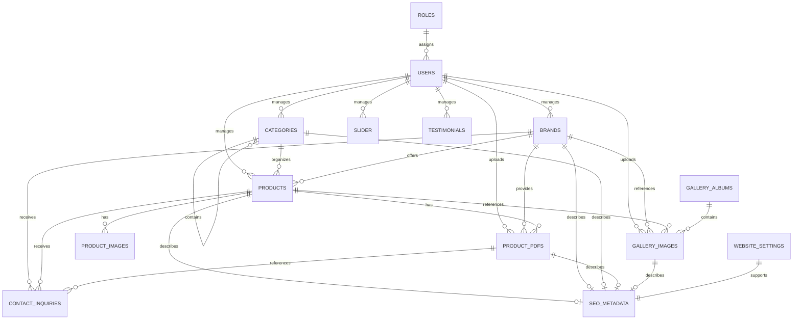

# Entity Relationship Diagram (ERD)

## Document Control

| Item | Details |
|---|---|
| Project Name | Nepack Website |
| Project Type | Dynamic Industrial Automation Company Website with CMS |
| Document Title | Entity Relationship Diagram (ERD) |
| Document Version | 1.0 |
| Document Status | Draft for Review |
| Technology Stack | HTML5, CSS3, Vanilla JavaScript, PHP 8.2, MySQL |
| Hosting Environment | Hostinger Shared Hosting |
| Prepared For | Nepack Website Project |
| Prepared By | Database Architecture Team |

## Revision History

| Version | Date | Description | Author | Status |
|---|---:|---|---|---|
| 1.0 | 2026-08-05 | Initial conceptual ERD documentation created | Database Architecture Team | Draft |

---

## 1. Introduction

This document defines the conceptual Entity Relationship Diagram for the Nepack Website database architecture.

The ERD explains how major business entities relate to each other before detailed table design, foreign key planning, index planning, and backend development begin.

This document is conceptual only. It does not define SQL, table columns, indexes, constraints, or physical database implementation.

---

## 2. Purpose

The purpose of this document is to provide a visual and descriptive conceptual model of the website database entities.

This document will support:

| Area | Purpose |
|---|---|
| Table Specifications | Provide entity relationship context before table-level documentation. |
| Foreign Key Planning | Clarify which entities conceptually depend on others. |
| Index Strategy | Help identify relationship-heavy and lookup-heavy areas later. |
| Backend Development | Guide data access and CMS workflow planning. |
| Data Governance | Clarify ownership, dependency, and lifecycle behavior. |

---

## 3. ER Modeling Principles

| Principle | Description |
|---|---|
| Conceptual First | The ERD defines business relationships before physical database design. |
| High-Level Entities Only | Only major entities are shown. Detailed attributes are intentionally excluded. |
| Clear Cardinality | Relationships identify one-to-one, one-to-many, or many-to-many behavior conceptually. |
| CMS Alignment | Relationships support admin-managed content, publishing, archiving, and public display. |
| Public Content Focus | Products, brands, downloads, gallery, SEO, and inquiries remain central to the model. |
| Scalability | The model should support future modules such as applications, industries, case studies, and blogs. |
| Implementation Independence | The ERD does not define tables, columns, indexes, or SQL syntax. |

---

## 4. Business Entities

| Entity | Conceptual Purpose |
|---|---|
| Users | Represents administrators who manage CMS content and settings. |
| Roles | Represents administrator access groups or permission levels. |
| Products | Represents industrial automation products shown on the public website. |
| Categories | Represents product categories and subcategories. |
| Brands | Represents product manufacturers, partner brands, or represented brands. |
| Product Images | Represents images associated with products. |
| Product PDFs | Represents downloadable product or brand documents. |
| Gallery Albums | Represents grouped gallery collections. |
| Gallery Images | Represents gallery items for products, projects, facilities, events, or brands. |
| Slider | Represents homepage or promotional banner content. |
| Testimonials | Represents public testimonial content. |
| Contact Inquiries | Represents visitor-submitted inquiry records. |
| SEO Metadata | Represents SEO metadata for public pages and dynamic content. |
| Website Settings | Represents global website configuration and company contact information. |

---

## 5. Entity Relationships

### Relationship Types

| Relationship Type | Meaning |
|---|---|
| One-to-One | One entity record is associated with one related record. |
| One-to-Many | One entity record may be associated with multiple related records. |
| Many-to-Many | Multiple records on both sides may relate to each other; used only where business need requires flexible mapping. |

### Conceptual Relationship Summary

| Source Entity | Target Entity | Relationship Type |
|---|---|---|
| Roles | Users | One-to-Many |
| Users | Products | One-to-Many |
| Users | Brands | One-to-Many |
| Users | Categories | One-to-Many |
| Users | Product PDFs | One-to-Many |
| Users | Gallery Images | One-to-Many |
| Categories | Categories | One-to-Many |
| Categories | Products | One-to-Many |
| Brands | Products | One-to-Many |
| Products | Product Images | One-to-Many |
| Products | Product PDFs | One-to-Many |
| Brands | Product PDFs | One-to-Many |
| Gallery Albums | Gallery Images | One-to-Many |
| Products | Gallery Images | Optional One-to-Many |
| Brands | Gallery Images | Optional One-to-Many |
| Products | Contact Inquiries | Optional One-to-Many |
| Brands | Contact Inquiries | Optional One-to-Many |
| Product PDFs | Contact Inquiries | Optional One-to-Many |
| SEO Metadata | Public Content Entities | Optional One-to-One |
| Website Settings | Website | Conceptual One-to-One |

### Many-to-Many Candidates

| Potential Relationship | Reason |
|---|---|
| Products and Categories | Required only if one product must appear in multiple categories. |
| Products and Product PDFs | Required only if one PDF applies to many products. |
| Brands and Categories | Required only if brand pages need category-level grouping. |
| Products and Gallery Images | Required only if one image relates to many products. |
| Future Applications and Products | Likely required for application-based product discovery. |
| Future Industries and Products | Likely required for industry-based product discovery. |

---

## 6. Mermaid ER Diagram

---

## 7. Relationship Descriptions

| Relationship | Business Purpose | Cardinality | Ownership |
|---|---|---|---|
| Roles to Users | Assign access level to CMS users. | One role to many users. | Super Administrator owns roles and user access. |
| Users to Products | Track administrative ownership of product content. | One user may manage many products. | Administrator owns product content. |
| Users to Categories | Track who manages category hierarchy. | One user may manage many categories. | Administrator owns category structure. |
| Users to Brands | Track who manages brand content. | One user may manage many brands. | Administrator owns brand content. |
| Categories to Categories | Support category and subcategory hierarchy. | One parent category may contain many child categories. | Administrator owns hierarchy. |
| Categories to Products | Organize products under browseable categories. | One category may contain many products. | Administrator owns classification. |
| Brands to Products | Associate products with represented or manufacturer brands. | One brand may have many products. | Administrator owns brand-product accuracy. |
| Products to Product Images | Provide product visual assets. | One product may have many images. | Administrator owns product media. |
| Products to Product PDFs | Provide product catalogs, datasheets, manuals, brochures, or certificates. | One product may have many PDFs. | Administrator owns product documents. |
| Brands to Product PDFs | Provide brand-related documents. | One brand may have many PDFs. | Administrator owns brand documents. |
| Gallery Albums to Gallery Images | Organize gallery images into public groups. | One album may contain many gallery images. | Administrator owns gallery organization. |
| Products to Gallery Images | Connect gallery visuals to product context. | Optional one product to many gallery images. | Administrator owns relationship accuracy. |
| Brands to Gallery Images | Connect gallery visuals to brand context. | Optional one brand to many gallery images. | Administrator owns relationship accuracy. |
| Products to Contact Inquiries | Preserve product inquiry context. | Optional one product to many inquiries. | Visitor creates inquiry; administrator manages response. |
| Brands to Contact Inquiries | Preserve brand inquiry context. | Optional one brand to many inquiries. | Visitor creates inquiry; administrator manages response. |
| Product PDFs to Contact Inquiries | Preserve document inquiry context. | Optional one PDF to many inquiries. | Visitor creates inquiry; administrator manages response. |
| Public Content to SEO Metadata | Attach SEO metadata to indexable public content. | Optional one-to-one per public content item. | Administrator or SEO Manager owns metadata. |
| Website Settings to Website | Provide global configuration and contact information. | Conceptual one-to-one. | Administrator owns global settings. |

---

## 8. Data Flow Overview

| Flow Area | Conceptual Data Movement |
|---|---|
| Admin Content Creation | Administrator creates products, categories, brands, documents, gallery images, slider items, testimonials, SEO metadata, and settings. |
| Content Publishing | Draft CMS content becomes public after validation and publish approval. |
| Product Display | Public product pages use products, categories, brands, images, PDFs, and SEO metadata. |
| Brand Display | Public brand pages use brand records, related products, related PDFs, gallery references, and SEO metadata. |
| Downloads Display | Public downloads use PDF records, related product or brand context, and SEO metadata. |
| Gallery Display | Public gallery pages use albums, images, captions, related products or brands, and SEO metadata. |
| Inquiry Submission | Visitor submits inquiry from contact, product, brand, or document context. |
| Inquiry Management | Administrator reviews, filters, and updates inquiry status conceptually. |
| SEO Rendering | Public pages use SEO metadata and website settings for search visibility. |
| Global Settings Usage | Header, footer, contact page, organization identity, and default SEO values use website settings. |

---

## 9. Future Expansion Considerations

| Future Area | ERD Impact |
|---|---|
| Applications | May introduce many-to-many relationships with products, gallery images, downloads, and case studies. |
| Industries | May relate to products, applications, case studies, and gallery images. |
| Case Studies | May connect products, brands, industries, applications, downloads, and gallery images. |
| Blog / Insights | May introduce articles, authors, tags, categories, and SEO metadata relationships. |
| Services | May connect to inquiries, service categories, and support content. |
| FAQ | May relate to products, categories, downloads, or service pages. |
| Advanced Product Filters | May require product attributes and attribute groups. |
| Product Comparison | May require shared structured product attributes. |
| Inquiry Workflow | May add assignment, notes, status history, and follow-up records. |
| Role-Based Permissions | May expand roles into granular permissions. |
| Redirect Management | May relate old URLs to products, categories, brands, downloads, and pages. |
| Audit Logs | May track entity changes across users, products, brands, downloads, settings, and SEO metadata. |
| Multilingual Content | May introduce language-specific versions of public content and SEO metadata. |

---

## 10. Related Documents

| Document | Purpose |
|---|---|
| 01_Project_Scope.md | Defines project scope, objectives, constraints, assumptions, and deliverables. |
| 02_Software_Requirement_Specification.md | Defines functional and non-functional software requirements. |
| 03_Feature_Breakdown.md | Defines feature-level planning and implementation scope. |
| Frontend Documentation | Defines information architecture, sitemap, user flows, page specifications, navigation, and SEO structure. |
| 01_Database_Plan.md | Defines conceptual database architecture strategy, entities, lifecycle, integrity, security, and scalability. |

---

## Approval Checklist

- [ ] Document Reviewed
- [ ] Technical Review Completed
- [ ] Scope Verified
- [ ] No Open Issues
- [ ] Approved for Next Phase

---

**End of Document**
