# User Flow

## Document Control

| Item | Details |
|---|---|
| Project Name | Nepack Website |
| Project Type | Dynamic Industrial Automation Company Website with CMS |
| Document Title | User Flow |
| Document Version | 1.0 |
| Document Status | Draft for Review |
| Technology Stack | HTML5, CSS3, Vanilla JavaScript, PHP 8.2, MySQL |
| Hosting Environment | Hostinger Shared Hosting |
| Prepared For | Nepack Website Project |
| Prepared By | UX Architecture Team |

## Revision History

| Version | Date | Description | Author | Status |
|---|---:|---|---|---|
| 1.0 | 2026-08-05 | Initial User Flow document created | UX Architecture Team | Draft |

---

## 1. Introduction

This document defines the major user flows for the Nepack Website. It describes how visitors and administrators interact with the website and CMS from entry to completion of key tasks.

The document focuses on user interaction, decision points, workflow sequence, and expected system responses. It does not define UI design, source code, database schema, or implementation logic.

---

## 2. Purpose

The purpose of this document is to establish complete interaction flows before design and development begin.

This document will support UX design, navigation planning, backend logic, CMS workflow planning, database planning, and testing.

---

## 3. User Types

| User Type | Description | Primary Goals |
|---|---|---|
| Visitor | Public website user, including buyers, engineers, procurement users, and business prospects. | Browse products, view brands, download PDFs, search content, submit inquiries, contact the company. |
| Administrator | Authorized CMS user responsible for managing website content. | Manage products, brands, gallery, downloads, media, inquiries, and published content. |

---

## 4. Visitor Journey

A visitor may enter through the homepage, search engine, direct product URL, brand page, download page, or contact page.

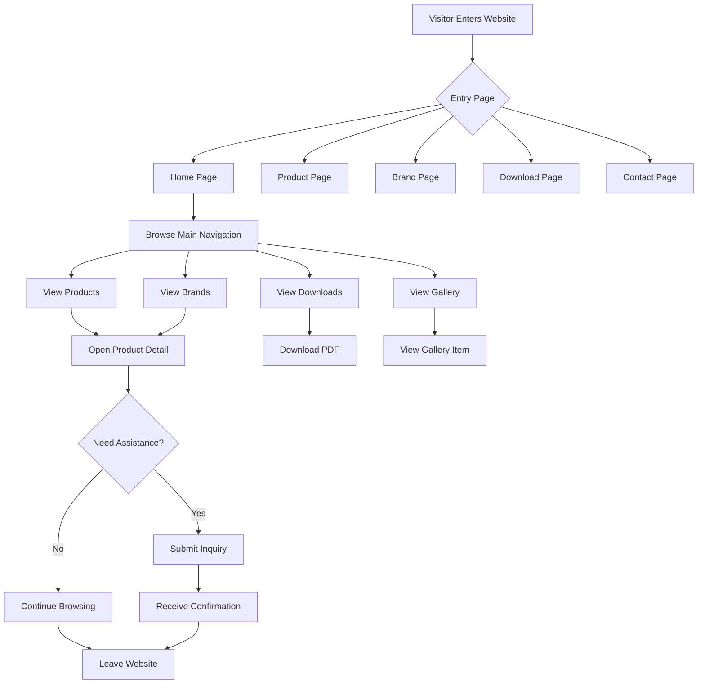
```mermaid
flowchart TD
    A[Visitor Enters Website] --> B{Entry Page}
    B --> C[Home Page]
    B --> D[Product Page]
    B --> E[Brand Page]
    B --> F[Download Page]
    B --> G[Contact Page]
    C --> H[Browse Main Navigation]
    H --> I[View Products]
    H --> J[View Brands]
    H --> K[View Downloads]
    H --> L[View Gallery]
    I --> M[Open Product Detail]
    J --> M
    K --> N[Download PDF]
    L --> O[View Gallery Item]
    M --> P{Need Assistance?}
    P -->|Yes| Q[Submit Inquiry]
    P -->|No| R[Continue Browsing]
    Q --> S[Receive Confirmation]
    R --> T[Leave Website]
    S --> T
```

| Step | Visitor Action | System Response |
|---|---|---|
| 1 | Lands on website | Displays relevant entry page. |
| 2 | Reviews navigation or content | Provides paths to products, brands, downloads, gallery, search, and contact. |
| 3 | Selects a content path | Displays selected listing or detail page. |
| 4 | Reviews details | Shows product, brand, download, or contact information. |
| 5 | Takes action | Allows inquiry submission, PDF download, or continued browsing. |
| 6 | Leaves website | Journey ends after task completion or browsing. |

---

## 5. Product Browsing Flow

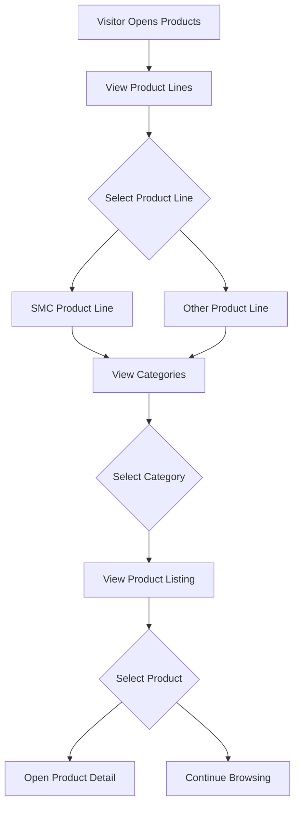
```mermaid
flowchart TD
    A[Visitor Opens Products] --> B[View Product Lines]
    B --> C{Select Product Line}
    C --> D[SMC Product Line]
    C --> E[Other Product Line]
    D --> F[View Categories]
    E --> F
    F --> G{Select Category}
    G --> H[View Product Listing]
    H --> I{Select Product}
    I --> J[Open Product Detail]
    I --> K[Continue Browsing]
```

| Step | User Action | Expected Outcome |
|---|---|---|
| 1 | Opens Products section | Product lines are available. |
| 2 | Selects product line | Relevant categories are displayed. |
| 3 | Selects category or subcategory | Product listing is displayed. |
| 4 | Selects product | Product detail page opens. |
| 5 | Continues browsing | User remains in product discovery path. |

---

## 6. Product Details Flow

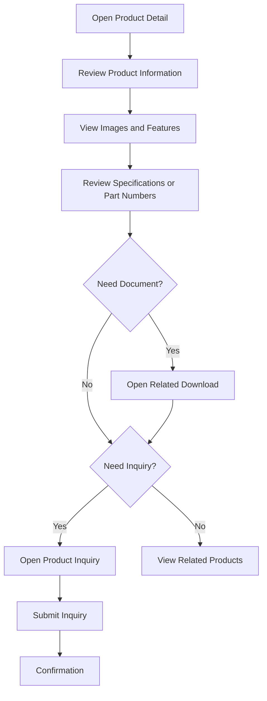
```mermaid
flowchart TD
    A[Open Product Detail] --> B[Review Product Information]
    B --> C[View Images and Features]
    C --> D[Review Specifications or Part Numbers]
    D --> E{Need Document?}
    E -->|Yes| F[Open Related Download]
    E -->|No| G{Need Inquiry?}
    F --> G
    G -->|Yes| H[Open Product Inquiry]
    G -->|No| I[View Related Products]
    H --> J[Submit Inquiry]
    J --> K[Confirmation]
```

| Product Detail Element | User Purpose |
|---|---|
| Product Name | Confirm product identity. |
| Category and Brand | Understand product classification. |
| Features | Evaluate product suitability. |
| Specifications | Review technical fit. |
| Part Numbers | Identify specific product variants. |
| Downloads | Access catalogs, datasheets, or manuals. |
| Related Products | Continue discovery. |
| Inquiry Action | Request pricing, availability, or support. |

---

## 7. Brand Browsing Flow

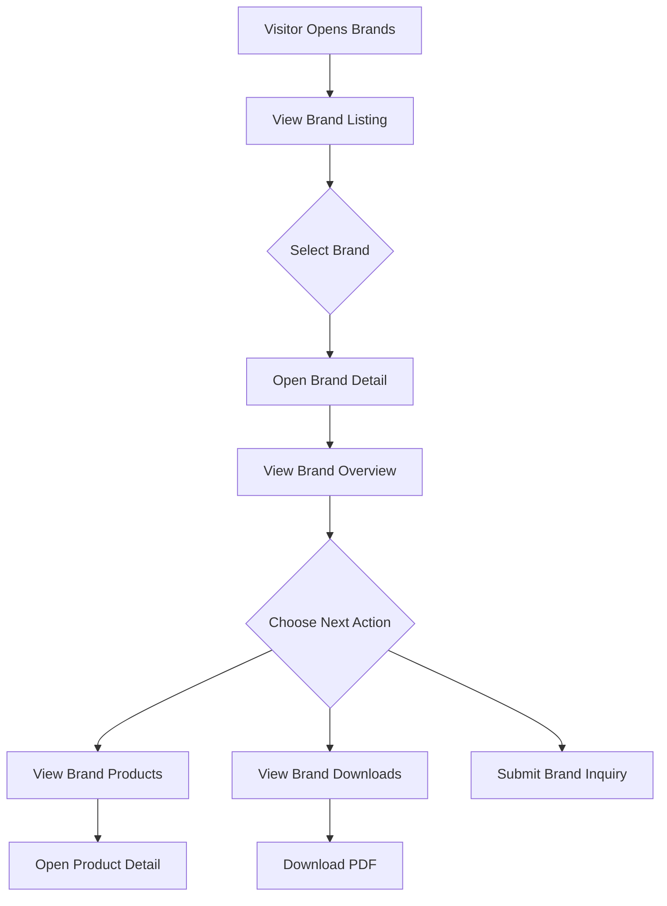
```mermaid
flowchart TD
    A[Visitor Opens Brands] --> B[View Brand Listing]
    B --> C{Select Brand}
    C --> D[Open Brand Detail]
    D --> E[View Brand Overview]
    E --> F{Choose Next Action}
    F --> G[View Brand Products]
    F --> H[View Brand Downloads]
    F --> I[Submit Brand Inquiry]
    G --> J[Open Product Detail]
    H --> K[Download PDF]
```

| Step | User Action | Expected Outcome |
|---|---|---|
| 1 | Opens Brands section | Brand listing is displayed. |
| 2 | Selects brand | Brand detail page opens. |
| 3 | Reviews brand information | Brand overview and related content are shown. |
| 4 | Views brand products | Product list filtered by brand is displayed. |
| 5 | Views brand downloads | Relevant documents are available. |
| 6 | Submits inquiry | Brand context is carried into inquiry flow. |

---

## 8. Gallery Viewing Flow

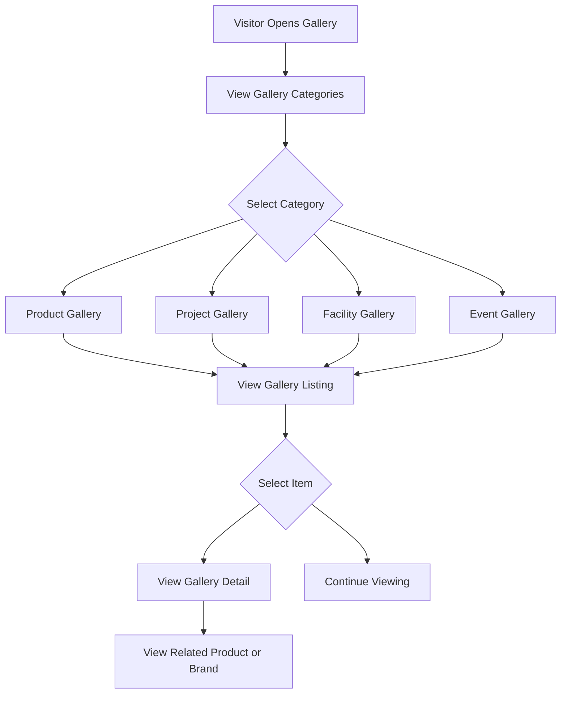
```mermaid
flowchart TD
    A[Visitor Opens Gallery] --> B[View Gallery Categories]
    B --> C{Select Category}
    C --> D[Product Gallery]
    C --> E[Project Gallery]
    C --> F[Facility Gallery]
    C --> G[Event Gallery]
    D --> H[View Gallery Listing]
    E --> H
    F --> H
    G --> H
    H --> I{Select Item}
    I --> J[View Gallery Detail]
    I --> K[Continue Viewing]
    J --> L[View Related Product or Brand]
```

| Step | User Action | Expected Outcome |
|---|---|---|
| 1 | Opens Gallery | Gallery categories are displayed. |
| 2 | Selects category | Related image listing appears. |
| 3 | Selects gallery item | Detail view opens where applicable. |
| 4 | Follows related link | User moves to related product or brand page. |

---

## 9. Downloads Flow

Downloads must support browsing, viewing details, and downloading PDF files.

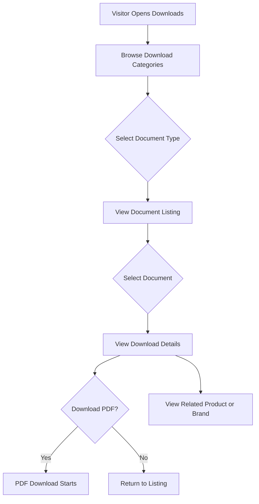
```mermaid
flowchart TD
    A[Visitor Opens Downloads] --> B[Browse Download Categories]
    B --> C{Select Document Type}
    C --> D[View Document Listing]
    D --> E{Select Document}
    E --> F[View Download Details]
    F --> G{Download PDF?}
    G -->|Yes| H[PDF Download Starts]
    G -->|No| I[Return to Listing]
    F --> J[View Related Product or Brand]
```

| Flow Area | Description |
|---|---|
| Browse | User browses download categories such as catalogs, datasheets, brochures, manuals, certificates, or brand documents. |
| View Details | User reviews document title, type, related product or brand, and file information. |
| Download PDF | User selects download action and receives the PDF file if available. |

---

## 10. Search Flow

Search should allow users to quickly locate products, brands, downloads, gallery items, and pages.

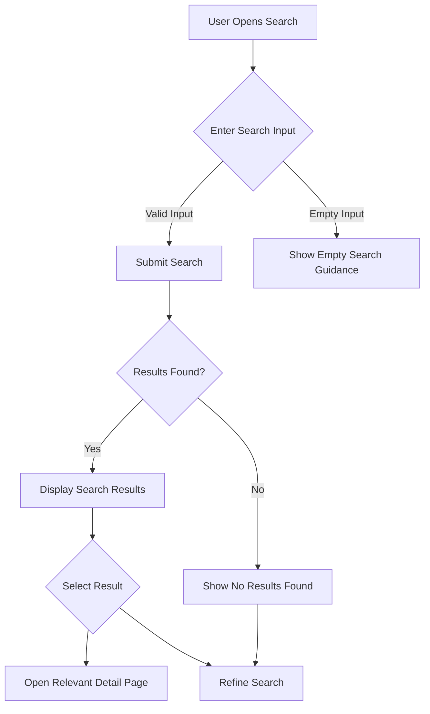
```mermaid
flowchart TD
    A[User Opens Search] --> B{Enter Search Input}
    B -->|Valid Input| C[Submit Search]
    B -->|Empty Input| D[Show Empty Search Guidance]
    C --> E{Results Found?}
    E -->|Yes| F[Display Search Results]
    E -->|No| G[Show No Results Found]
    F --> H{Select Result}
    H --> I[Open Relevant Detail Page]
    H --> J[Refine Search]
    G --> J
```

| Search Scenario | System Response |
|---|---|
| Search Input | Accepts keyword, product name, brand name, category, document title, or part number. |
| Search Results | Displays matching products, brands, downloads, gallery items, and pages. |
| No Results Found | Shows no result state and allows user to refine search or contact the company. |
| Empty Search | Prompts user to enter a search term before displaying results. |

---

## 11. Contact & Inquiry Flow

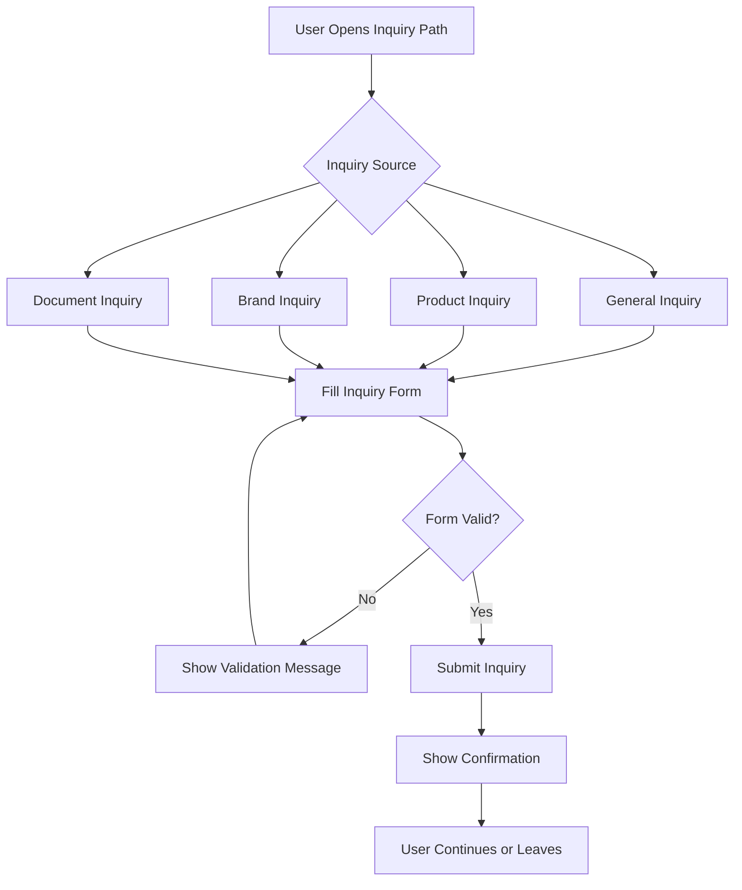
```mermaid
flowchart TD
    A[User Opens Inquiry Path] --> B{Inquiry Source}
    B --> C[General Inquiry]
    B --> D[Product Inquiry]
    B --> E[Brand Inquiry]
    B --> F[Document Inquiry]
    C --> G[Fill Inquiry Form]
    D --> G
    E --> G
    F --> G
    G --> H{Form Valid?}
    H -->|No| I[Show Validation Message]
    I --> G
    H -->|Yes| J[Submit Inquiry]
    J --> K[Show Confirmation]
    K --> L[User Continues or Leaves]
```

| Inquiry Type | Source | Context |
|---|---|---|
| General Inquiry | Contact page, footer, floating action | General requirement. |
| Product Inquiry | Product detail page | Product name or product context. |
| Brand Inquiry | Brand detail page | Brand name or brand context. |
| Document Inquiry | Download detail page | Document title or document context. |

---

## 12. Admin Authentication Flow

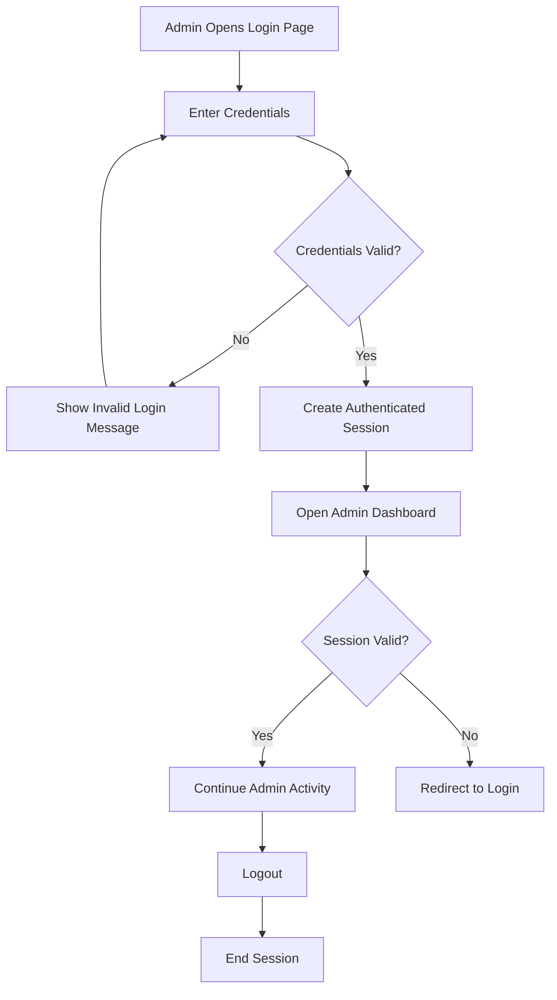
```mermaid
flowchart TD
    A[Admin Opens Login Page] --> B[Enter Credentials]
    B --> C{Credentials Valid?}
    C -->|No| D[Show Invalid Login Message]
    D --> B
    C -->|Yes| E[Create Authenticated Session]
    E --> F[Open Admin Dashboard]
    F --> G{Session Valid?}
    G -->|Yes| H[Continue Admin Activity]
    G -->|No| I[Redirect to Login]
    H --> J[Logout]
    J --> K[End Session]
```

| Authentication Stage | Description |
|---|---|
| Login | Administrator enters authorized credentials. |
| Session Validation | System verifies active session before allowing admin access. |
| Logout | Administrator ends the session and returns to login state. |
| Invalid Login | System displays an error without granting access. |
| Session Expiry | Expired sessions require re-authentication. |

---

## 13. Product Management Flow

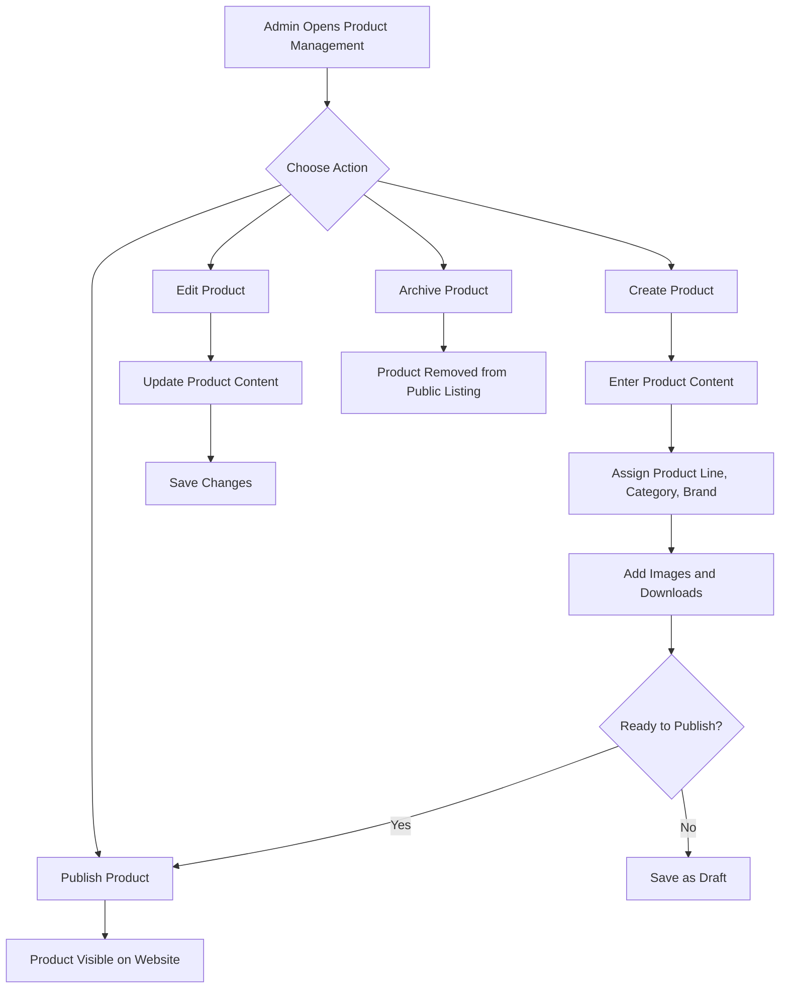
```mermaid
flowchart TD
    A[Admin Opens Product Management] --> B{Choose Action}
    B --> C[Create Product]
    B --> D[Edit Product]
    B --> E[Publish Product]
    B --> F[Archive Product]
    C --> G[Enter Product Content]
    G --> H[Assign Product Line, Category, Brand]
    H --> I[Add Images and Downloads]
    I --> J{Ready to Publish?}
    J -->|No| K[Save as Draft]
    J -->|Yes| E
    D --> L[Update Product Content]
    L --> M[Save Changes]
    E --> N[Product Visible on Website]
    F --> O[Product Removed from Public Listing]
```

| Action | Workflow Outcome |
|---|---|
| Create | New product content is prepared and saved. |
| Edit | Existing product content is updated. |
| Publish | Product becomes visible on public website. |
| Archive | Product is removed from public listings while retained for administration. |

---

## 14. Brand Management Flow

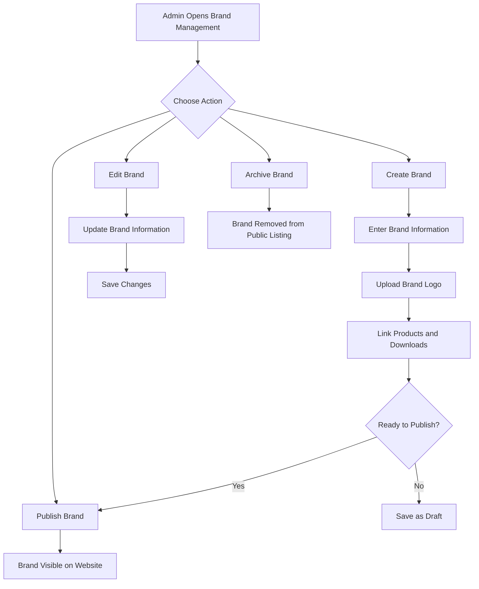
```mermaid
flowchart TD
    A[Admin Opens Brand Management] --> B{Choose Action}
    B --> C[Create Brand]
    B --> D[Edit Brand]
    B --> E[Publish Brand]
    B --> F[Archive Brand]
    C --> G[Enter Brand Information]
    G --> H[Upload Brand Logo]
    H --> I[Link Products and Downloads]
    I --> J{Ready to Publish?}
    J -->|No| K[Save as Draft]
    J -->|Yes| E
    D --> L[Update Brand Information]
    L --> M[Save Changes]
    E --> N[Brand Visible on Website]
    F --> O[Brand Removed from Public Listing]
```

| Action | Workflow Outcome |
|---|---|
| Create | New brand record and content are prepared. |
| Edit | Existing brand information is updated. |
| Publish | Brand becomes visible on public website. |
| Archive | Brand is removed from public listings while retained in admin. |

---

## 15. Gallery Management Flow

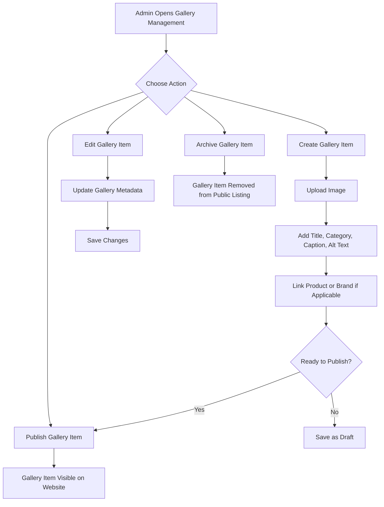
```mermaid
flowchart TD
    A[Admin Opens Gallery Management] --> B{Choose Action}
    B --> C[Create Gallery Item]
    B --> D[Edit Gallery Item]
    B --> E[Publish Gallery Item]
    B --> F[Archive Gallery Item]
    C --> G[Upload Image]
    G --> H[Add Title, Category, Caption, Alt Text]
    H --> I[Link Product or Brand if Applicable]
    I --> J{Ready to Publish?}
    J -->|No| K[Save as Draft]
    J -->|Yes| E
    D --> L[Update Gallery Metadata]
    L --> M[Save Changes]
    E --> N[Gallery Item Visible on Website]
    F --> O[Gallery Item Removed from Public Listing]
```

---

## 16. Download Management Flow

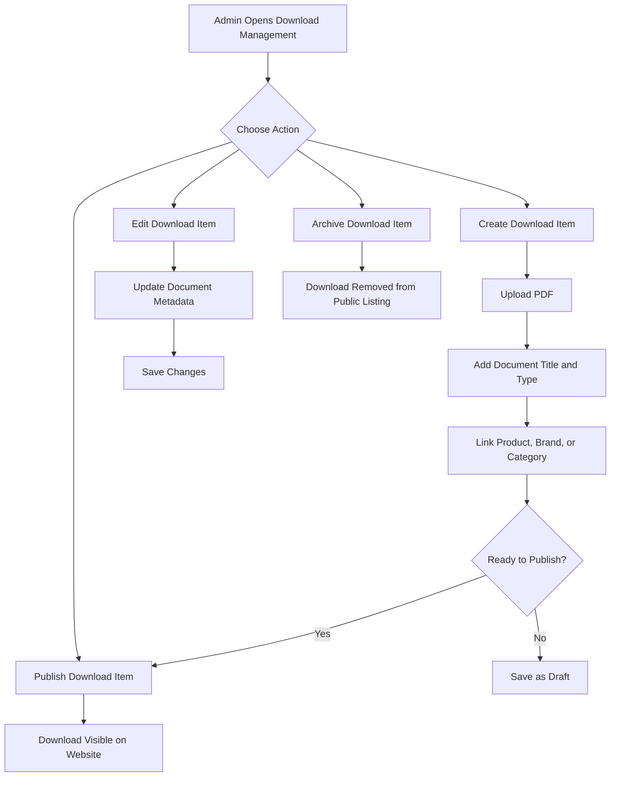
```mermaid
flowchart TD
    A[Admin Opens Download Management] --> B{Choose Action}
    B --> C[Create Download Item]
    B --> D[Edit Download Item]
    B --> E[Publish Download Item]
    B --> F[Archive Download Item]
    C --> G[Upload PDF]
    G --> H[Add Document Title and Type]
    H --> I[Link Product, Brand, or Category]
    I --> J{Ready to Publish?}
    J -->|No| K[Save as Draft]
    J -->|Yes| E
    D --> L[Update Document Metadata]
    L --> M[Save Changes]
    E --> N[Download Visible on Website]
    F --> O[Download Removed from Public Listing]
```

| Action | Workflow Outcome |
|---|---|
| Create | New downloadable document is uploaded and described. |
| Edit | Existing document metadata or file is updated. |
| Publish | Document becomes visible on public website. |
| Archive | Document is removed from public listings while retained in admin. |

---

## 17. Media Upload Flow

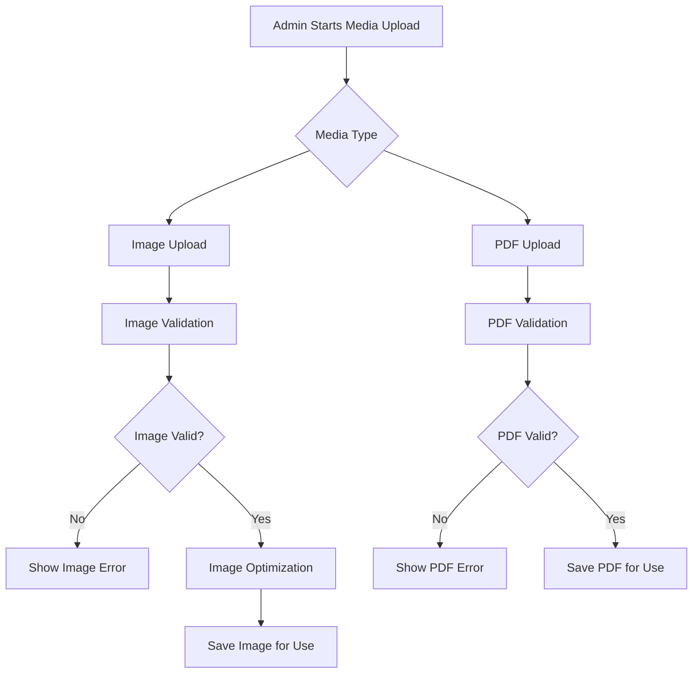
```mermaid
flowchart TD
    A[Admin Starts Media Upload] --> B{Media Type}
    B --> C[Image Upload]
    B --> D[PDF Upload]
    C --> E[Image Validation]
    E --> F{Image Valid?}
    F -->|No| G[Show Image Error]
    F -->|Yes| H[Image Optimization]
    H --> I[Save Image for Use]
    D --> J[PDF Validation]
    J --> K{PDF Valid?}
    K -->|No| L[Show PDF Error]
    K -->|Yes| M[Save PDF for Use]
```

| Media Step | Description |
|---|---|
| Image Upload | Administrator uploads image for product, brand, gallery, or content use. |
| Image Validation | System checks accepted image type, size, and basic file suitability. |
| Image Optimization | System prepares image for public website performance where applicable. |
| PDF Upload | Administrator uploads catalog, brochure, datasheet, manual, or certificate. |
| PDF Validation | System checks accepted file type, size, and basic file suitability. |

---

## 18. Error Handling Flows

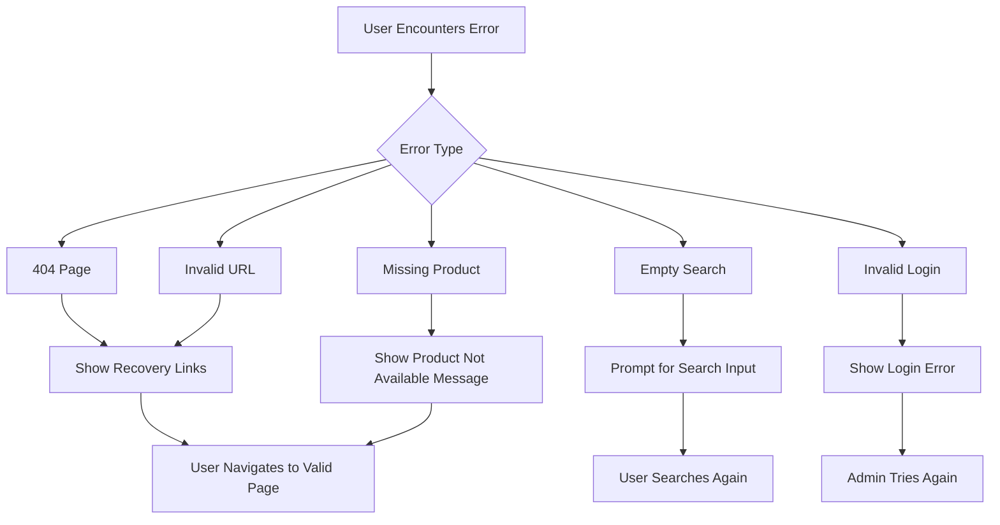
```mermaid
flowchart TD
    A[User Encounters Error] --> B{Error Type}
    B --> C[404 Page]
    B --> D[Invalid URL]
    B --> E[Missing Product]
    B --> F[Empty Search]
    B --> G[Invalid Login]
    C --> H[Show Recovery Links]
    D --> H
    E --> I[Show Product Not Available Message]
    F --> J[Prompt for Search Input]
    G --> K[Show Login Error]
    H --> L[User Navigates to Valid Page]
    I --> L
    J --> M[User Searches Again]
    K --> N[Admin Tries Again]
```

| Error Scenario | User/System Flow |
|---|---|
| 404 Page | User sees page not found state with links to Home, Products, Search, and Contact. |
| Invalid URL | User is routed to error state or helpful recovery page. |
| Missing Product | Product unavailable message appears with links to category, search, or inquiry. |
| Empty Search | User is prompted to enter a search term. |
| Invalid Login | Administrator receives login error and may retry. |

---

## 19. Security Flow

Security flows should protect administrative access, user submissions, and file handling at a conceptual level.

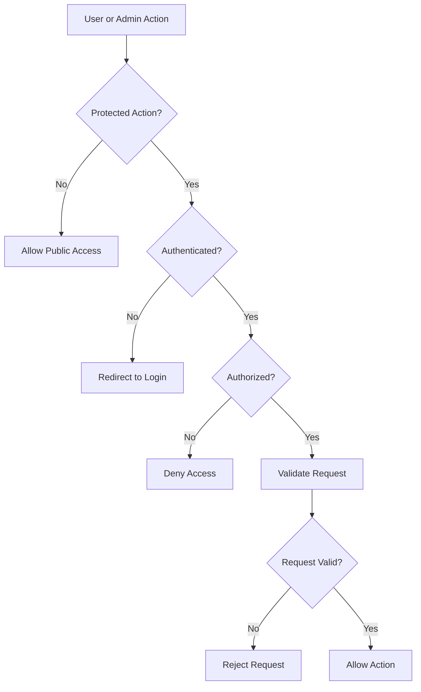
```mermaid
flowchart TD
    A[User or Admin Action] --> B{Protected Action?}
    B -->|No| C[Allow Public Access]
    B -->|Yes| D{Authenticated?}
    D -->|No| E[Redirect to Login]
    D -->|Yes| F{Authorized?}
    F -->|No| G[Deny Access]
    F -->|Yes| H[Validate Request]
    H --> I{Request Valid?}
    I -->|No| J[Reject Request]
    I -->|Yes| K[Allow Action]
```

| Security Area | Conceptual Flow |
|---|---|
| Authentication | Admin must log in before accessing CMS pages. |
| Authorization | Admin actions should be limited by role or permission where applicable. |
| Session Expiry | Expired sessions should return the administrator to login. |
| CSRF Protection | Sensitive admin and inquiry submissions should validate request authenticity conceptually. |
| File Validation | Uploaded images and PDFs should be validated before storage or publishing. |

---

## 20. Future User Flows

| Future Flow | Description |
|---|---|
| Application-Based Product Discovery | Visitor browses products by application or use case. |
| Industry-Based Browsing | Visitor selects industry and views relevant solutions or products. |
| Case Study Journey | Visitor reads a project story and navigates to related products or inquiry. |
| Blog / Insight Journey | Visitor reads technical articles and follows links to products or downloads. |
| Service Request Flow | Visitor submits a support or maintenance request. |
| Careers Application Flow | Candidate views job openings and submits an application. |
| Advanced Product Filter Flow | Visitor filters products by technical attributes. |
| Admin Role Management Flow | Super admin manages access permissions for different CMS users. |
| Inquiry Follow-Up Flow | Admin tracks inquiry status from new to resolved. |

---

## 21. Related Documents

| Document | Purpose |
|---|---|
| 01_Project_Scope.md | Defines project scope, objectives, constraints, and deliverables. |
| 02_Software_Requirement_Specification.md | Defines functional and non-functional software requirements. |
| 03_Feature_Breakdown.md | Defines feature-level planning and implementation scope. |
| 01_Information_Architecture.md | Defines content hierarchy, navigation hierarchy, and content relationships. |
| 02_Sitemap.md | Defines page hierarchy, conceptual URL structure, and sitemap planning. |

---

## Approval Checklist

- [ ] Document Reviewed
- [ ] Technical Review Completed
- [ ] Scope Verified
- [ ] No Open Issues
- [ ] Approved for Next Phase

---

**End of Document**
